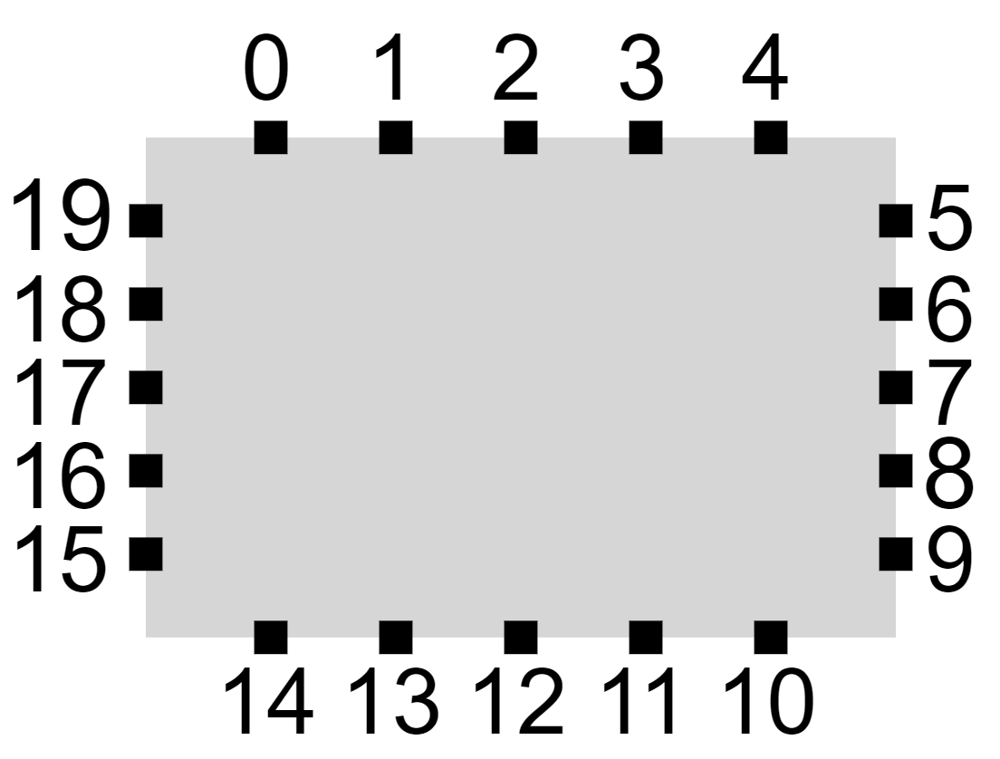

# cytoscape.js-cosep

## Description

Compound Spring Embedder with Ports (CoSEP) is a force-directed layout algorithm 
based on the [CoSE (Compound Spring Embedder)](https://github.com/cytoscape/cytoscape.js-cose-bilkent) to 
support port constraints on compound graphs. Further improvements are achieved by various heuristics such as shifting port constrained 
edges around the node and by rotating nodes.

Here is a [demo](https://raw.githack.com/iVis-at-Bilkent/cytoscape.js-cosep/unstable/demo/demo.html) illustrating CoSEP's capabilities. You may use samples available for testing or upload your own graph in [GraphML](https://en.wikipedia.org/wiki/GraphML) format and add constraints manually. Quality metrics such as *ratio of properly oriented edge ends* (an edge end is deemed as *properly oriented* if its edge does not intersect with its end node.) and edge-edge crossing count are provided after layout as well as the total running time. Many options, some inherited from CoSEP's predecessor CoSE, are exposed to the user to fine tune the algorithm.

## Dependencies

 * Cytoscape.js: ^3.2.0
 * cose-base ^2.0.0

## Documentation

Port constraints are associated with edges and can have two port constraints defined on each of its
endpoints. When an edge endpoint does not have a specified port constraint, it is assumed that it connects 
to the center of the source/target node (the edge is typically rendered w.r.t. to the source/target node 
shape’s boundaries however). 

The ports are realized as discrete points distributed evenly around a node. The ports then can be indexed 
clock-wise as {0, 1, 2, … , 4k-1} starting at the top-left where k > 0 is the number of 
ports on each side, specified by the user. For instance, ports are distributed as follows when k = 5: 

<p align="center"></p>

Various degrees of port constraints can be defined on edge endpoints:
 * **Free**: The specified end of the edge can be placed at any port of the associated node
 * **Fixed Side(s)**: A set *s* of directions from {top, left, bottom, right} can be assigned to an edge end
 * **Absolute Position**: Using the indices of ports, edge ends can be assigned to specific / static positions
 
## Usage instructions

Download the library:
 * via npm: `npm install cytoscape-cosep`,
 * via bower: `bower install cytoscape-cosep`, or
 * via direct download in the repository (probably from a tag).

Import the library as appropriate for your project:

ES import:

```js
import cytoscape from 'cytoscape';
import cosep from 'cytoscape-cosep';

cytoscape.use( cosep );
```

CommonJS require:

```js
let cytoscape = require('cytoscape');
let cosep = require('cytoscape-cosep');

cytoscape.use( cosep ); // register extension
```

AMD:

```js
require(['cytoscape', 'cytoscape-cosep'], function( cytoscape, cosep ){
  cosep( cytoscape ); // register extension
});
```
Plain HTML/JS has the extension registered for you automatically, because no `require()` is needed.

 ## API
 
When calling the layout, e.g. `cy.layout({ name: 'cosep', ... })`, the following options are supported:

``` js
var options = {
    // -------- Mandatory parameters --------
    name = 'cosep',
    
    // This is the number specifying the number of ports on one node's side. If three is given, there would be 
    // twelve ports around one node.
    portsPerNodeSide: 3,
        
    // Port constraints information has to be given as a function.
    // For the fcn, it would be given a Cytoscape edge and is expected to return constraint info about that edge.
    // Since both endpoints of an edge can have port constraints, this fcn returns an array. (See below)
    portConstraints: portInfo,
    
    /* The format of the array that "portInfo" returns has to be in the following way:
    [{
      "endpoint": "Target",             // or "Source"
      "portConstraintType": "Sided",    // or "Free" or "Absolute"
      "portConstraintParameter": [      // or any combination of node sides.                               
        "Top",                          // If it is "Free", this line doesn't matter. If "Absolute", any number 
        "Bottom"]                       // denoting the port location will do. e.g. "3"
    },
    {
      "endpoint": "Source",             // Here both endpoints are port constrained. If only "Target" or "Source"
      "portConstraintType": "Absolute", // is to be constrained, omit the other object from the array.
      "portConstraintParameter": "3"
    }]
    */
    
    /*
    ---------------- Optional parameters ----------------
    Don't include anything if you are not going to change the value
    Otherwise, you can add the specific line with changed parametre
    */
    
    // Whether to animate the layout
    // - true : Animate while the layout is running
    // - false : Just show the end result
    // - 'end' : Animate directly to the end result
    animate: false,
    
    // number of ticks per frame; higher is faster but more jerky
    refresh: 30,
    
    // Used to slow down time in animation:'during'
    fps: 30, 
    
    // so you can't drag nodes during layout
    ungrabifyWhileSimulating: false, 
    
    // on every layout reposition of nodes, fit the viewport
    fit: true, 
   
    // padding around the simulation
    padding: 30, 

    // positioning options
    randomize: true, // use random node positions at beginning of layout
    
    // Node repulsion (non overlapping) multiplier
    nodeRepulsion: node => 4500,
    
    // Ideal edge (non nested) length
    idealEdgeLength: edge => 50,
    
    // Divisor to compute edge forces
    edgeElasticity: edge => 0.45,
    
    // Nesting factor (multiplier) to compute ideal edge length for nested edges
    nestingFactor: 0.1,
    
    // Gravity force (constant)
    gravity: 0.25,
    
    // Whether to tile disconnected nodes
    tile: true,
    
    // Represents the amount of the vertical space to put between the zero degree members during the tiling operation
    // Can also be a function
    tilingPaddingVertical: 10,
    
    // Represents the amount of the horizontal space to put between the zero degree members during the tiling operation
    // Can also be a function
    tilingPaddingHorizontal: 10,
    
    // Gravity range (constant) for compounds
    gravityRangeCompound: 1.5,
    
    // Gravity force (constant) for compounds
    gravityCompound: 1.0,
    
    // Gravity range (constant)
    gravityRange: 3.8,

    // Whether a node can be rotated/swapped
    nodeRotations: node => true,
    
    // Thresholds for force in Phase II
    edgeEndShiftingForceThreshold: 1,
    nodeRotationForceThreshold: 20,
    rotation180RatioThreshold: 0.5,
    rotation180AngleThreshold: 130,

    // Periods for Phase II
    edgeEndShiftingPeriod: 5,
    nodeRotationPeriod: 15,

    // Polishing Force
    polishingForce: 0.1,

    // Grouping 1-Degree Nodes Across Ports
    furtherHandlingOneDegreeNodes: true,
    furtherHandlingOneDegreeNodesPeriod: 50,
    
    // layout event callbacks
    ready: function(){}, // on layoutready
    stop: function(){}, // on layoutstop
}
 ```

## Build targets

* `npm run test` : Run Mocha tests in `./test`
* `npm run build` : Build `./src/**` into `cytoscape-cosep.js`
* `npm run watch` : Automatically build on changes with live reloading (N.b. you must already have an HTTP server running)
* `npm run dev` : Automatically build on changes with live reloading with webpack dev server
* `npm run lint` : Run eslint on the source

N.b. all builds use babel, so modern ES features can be used in the `src`.


## Publishing instructions

This project is set up to automatically be published to npm and bower.  To publish:

1. Build the extension : `npm run build:release`
1. Commit the build : `git commit -am "Build for release"`
1. Bump the version number and tag: `npm version major|minor|patch`
1. Push to origin: `git push && git push --tags`
1. Publish to npm: `npm publish .`
1. If publishing to bower for the first time, you'll need to run `bower register cytoscape-cosep https://github.com/iVis-at-Bilkent/cytoscape.js-cosep.git`
1. [Make a new release](https://github.com/iVis-at-Bilkent/cytoscape.js-cosep/releases/new) for Zenodo.

## Team

  * [Alihan Okka](https://github.com/alihanokka) and [Ugur Dogrusoz](https://github.com/ugurdogrusoz) of [i-Vis at Bilkent University](http://www.cs.bilkent.edu.tr/~ivis)
